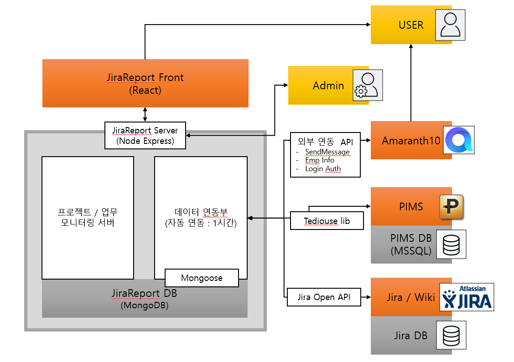

# jiraReport Back
## 개요
- 프로젝트 / 업무 모니터링 페이지 및 Pims - Jira - JiraReport 연동 기능의 통합 프로그램 작성

## 관련 프로그램
1. PIMS
    - 더존 비즈온 사에서 개발된 .Net 기반 프로젝트/업무 관리 패키지 프로그램
2. Jira
    - Atlassian 사에서 개발된 Web 기반의 에자일 프로젝트/업무 관리 시스템
3. Amaranth10 
    - 더존 비즈온 사에서 개발된 차세대 그룹웨어, Erp 솔루션

## 사용 기술
- Node.js (express)
- mongoDB - mongoose
- MSSQL - tediouse
- sqlite - sqlite3

## 구조도
